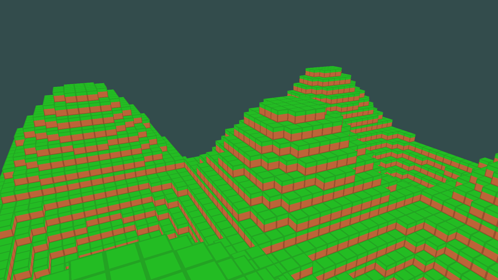

# hypercube
Minecraft clone in haskell focussed on performance.

## downloading
```haskell
$ darcs clone --lazy Noughtmare@hub.darcs.net:Noughtmare/hypercube
$ cd hypercube
```

## building
```haskell
$ stack build
```

## running
```haskell
$ stack exec hypercube
```

## screenshots


