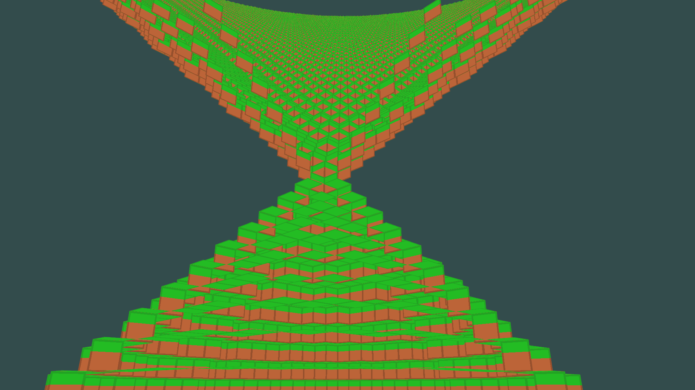
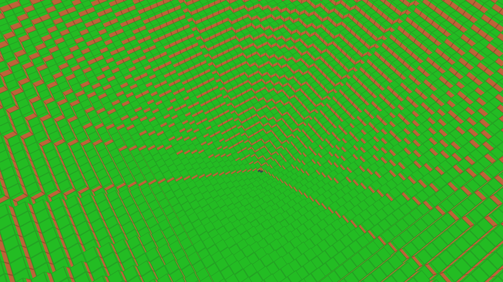
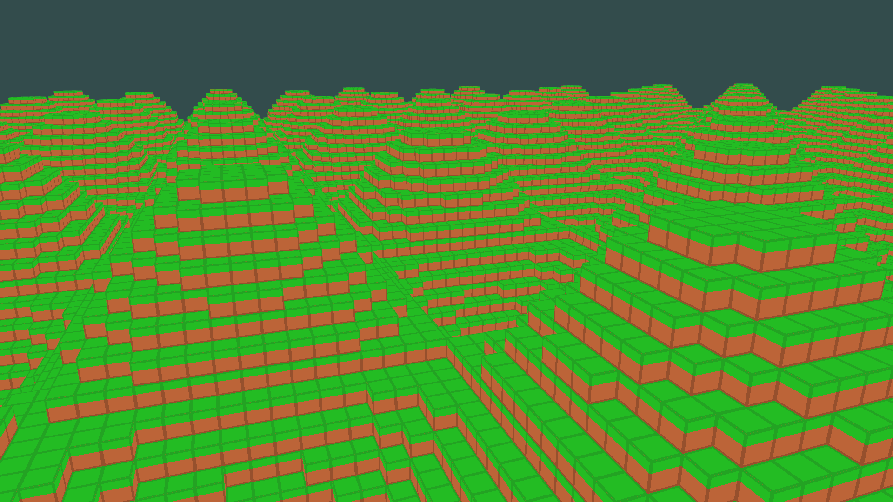

**This program is not very efficient yet, I've been sucked into voxel engine optimizations and I have yet to find the time to play around with different kind of implementations. Also I wrote this code quite a while ago and I wouldn't consider it very idiomatic, but it is a working example of how to use OpenGL in Haskell.**

# hypercube
Minecraft clone in haskell focussed on performance.

## downloading
```shell
$ git clone https://github.com/noughtmare/hypercube.git
$ cd hypercube
```

## building

Make sure you have the right system dependencies, they are listed in
`shell.nix`.

Build with cabal:

```shell
$ cabal build
```

## running

```shell
$ cabal run
```

## controls

```
W     - move forward
A     - move to the left
S     - move backward
D     - move to the right
SHIFT - move down
SPACE - move up
CTRL  - speed up
R     - toggle mouse cursor
ESC   - quit game
```

## screenshots






